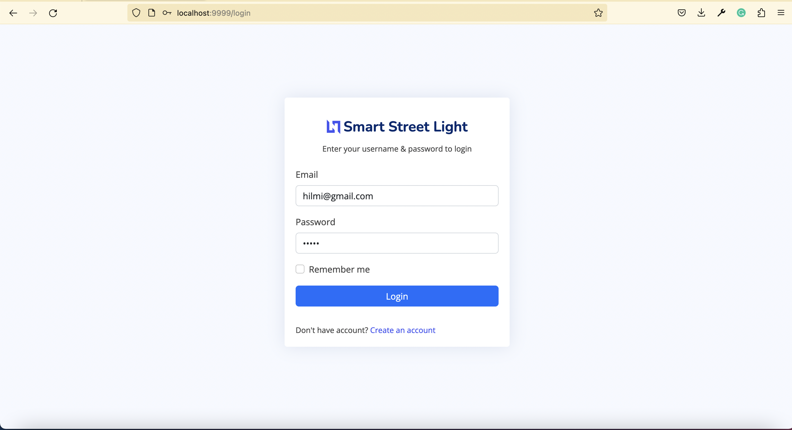
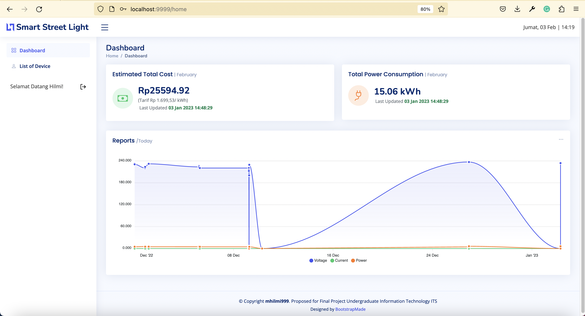
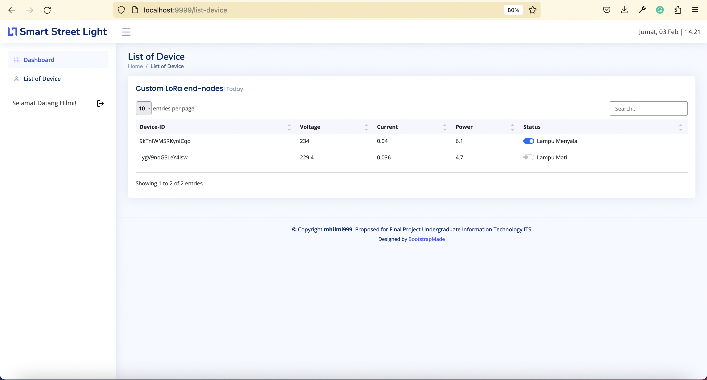

# Documentation Presentation
## Final Project of Bachelor Degree
[View the Presentation]([https://github.com/mhilmi999/Tugas-Akhir-Smart-Street-Light-LoRaWAN](https://docs.google.com/presentation/d/1WL7GJ676_46_-2-AJBF_TlKwIyaG7xFXZGKN8_uwHc8/edit?usp=sharing))

## International Journal ISITIA 2023
[See the Conference]([https://github.com/mhilmi999/Tugas-Akhir-Smart-Street-Light-LoRaWAN](https://docs.google.com/presentation/d/11-YCotPrYtim7DABWWCKuuAZa3wxNNcI8QoDBYtIVPg/edit?usp=sharing))

## Hal-hal yang dibutuhkan
- Bahasa Pemrograman Go [Go official website](https://go.dev/)
- Pengetahuan atas [Gin Framework](https://gin-gonic.com/)
- Pemahaman implementasi MySQL yang terimplementasi oleh [GORM](https://gorm.io/)
- Sistem folder yang berbasis code base [Clean Architecture](https://medium.com/golangid/mencoba-golang-clean-architecture-c2462f355f41)
- CSS yang dibangun dengan integrasi [Bootstrap 5](https://getbootstrap.com/docs/5.0/getting-started/introduction/)

## Instalasi dan Menjalankan Sistem Aplikasi
- Unduh dan [Clone repository](https://github.com/mhilmi999/Tugas-Akhir-Smart-Street-Light-LoRaWAN.git) ini pada IDE kesayangan Anda
- Pastikan Go telah terinstall pada perangkat anda, hal ini d
apat dilakukan dengan command (Contoh dengan Mac):
    ```
    go --version 
    ```
- Lanjutkan dengan melakukan import database [Smartstreetlighrt.sql](sql/smartstreetlight.sql) pada database adminer (phpmyadmin/mariadb/dbeaver) Anda.
- Pastikan Anda berada pada path dimana project berada ketika ingin menjalankannya berikut contohnya: 
    ```
    mhilmi@mhilmis-MacBook-Pro Tugas-Akhir-Smart-Street-Light-LoRaWAN % pwd
    /Users/mhilmi/Documents/golangProject/src/github.com/mhilmi999/Tugas-Akhir-Smart-Street-Light-LoRaWAN
    mhilmi@mhilmis-MacBook-Pro Tugas-Akhir-Smart-Street-Light-LoRaWAN % 
    ```
- Jalankan auto download library aplikasi dengan command:
    ```
    go mod init
    go mod vendor
    go mod tidy
    ```
- Jalankan aplikasi dengan command:
    ```
    go run main.go
    ```
- Buka browser dan ketikan pada url
    ```
    localhost:9999
    ```
- Setelah sukses seharusnya tampil laman login dengan:
    ```
    username    : hilmi@email.com
    password    : 12345
    ```
    
- Berikut merupakan tampilan awal ketika mencapai dashboard yang dibangun
    
- Tampilan laman list perangkat 
    


